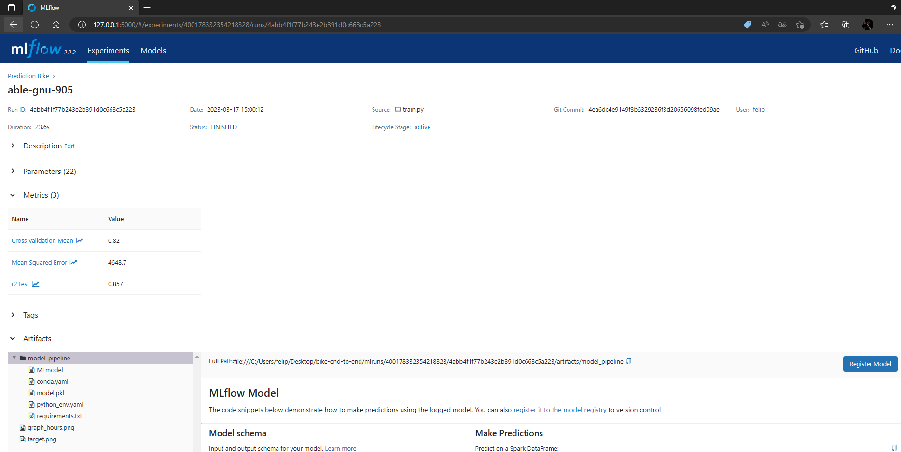

# Bike Sharing Demand with Mlflow, Flask and Streamlit

## Table of Contents

- [Project Description](#project-description)
- [Data](#data)
- [Methodology](#methodology)
- [Results](#results)
- [Usage](#usage)

## Project Description

In this project, our goal is to perform an analysis on the Bike Sharing Demand dataset, seeking to explore different ways of consuming a generated model. In this case, I used Mlflow to register the model and Flask and Streamlit applications to serve the model. A brief exploratory analysis was done, which can be consulted in the notebook.

## Data

There are 2 datasets provided, one for training and another for testing. The analysis was performed using the training dataset, as well as the selection of features that were used to build the model. Our features are:

| Feature Name | Description |
| --- | --- |
| season | A categorical feature that represents the season of the year (1:spring, 2:summer, 3:fall, 4:winter) |
| holiday | A binary feature that indicates whether the day is a holiday or not (1:yes, 0:no) |
| workingday | A binary feature that indicates whether the day is a working day or not (1:yes, 0:no) |
| weather | A categorical feature that represents the weather condition on the day (1: Clear, Few clouds, Partly cloudy, Partly cloudy, 2: Mist + Cloudy, Mist + Broken clouds, Mist + Few clouds, Mist, 3: Light Snow, Light Rain + Thunderstorm + Scattered clouds, Light Rain + Scattered clouds, Light Rain + Few clouds, 4: Heavy Rain + Ice Pallets + Thunderstorm + Mist, Snow + Fog) |
| temp | A continuous feature that represents the temperature in Celsius |
| atemp | A continuous feature that represents the "feels like" temperature in Celsius |
| humidity | A continuous feature that represents the relative humidity |
| windspeed | A continuous feature that represents the wind speed |
| hour | A categorical feature that represents the hour of the day (0-23) |
| month | A categorical feature that represents the month of the year (1-12) |
| weekday | A categorical feature that represents the day of the week (0-Sunday, 1-Monday, ..., 6-Saturday) |

The test dataset has the same features. I transformed the datetime in both datasets to contain the columns "hour", "month", and "weekday".

## Methodology

In the modeling process, I chose to create a pipeline that uses the functions I built in the notebook. The rush_hour function provides us with a new column "peak", classifying peak hour occurrences, where 1 represents True and 0 represents False.

```python
def rush_hour(X):
  df=X.copy()
  c1=((df['weekday'].isin([0,6])) & ((df['hour']>=10) & (df['hour']<=17)))
  c2=((df['weekday'].isin([0,6])==False) & (((df['hour']>=17) & (df['hour']<=19)) | (df['hour']==8)))
  df['peak']=np.where(c1,1,np.where(c2,1,0))
  return df
  ```
As shown in the notebook, the distribution of the target feature is improved when we apply a log transformation. Therefore, I created a function for this transformation as well as the inverse log transformation.
  ```python
  def log_target(target):
     return np.log(target)

  def exp_log(target):
     return np.exp(target)
   ```
Finally, we applied all of this to a pipeline using the Random Forest Regressor. We used the TransformedTargetRegressor from sklearn to apply the transformation to the target column and fit the model to the data.

  ```python
  pipeline=Pipeline([
          ('transformer_pico', FunctionTransformer(rush_hour)),
          ('target_transform_plus_regressor',TransformedTargetRegressor(regressor=RandomForestRegressor(),func=log_target,inverse_func=exp_log))
])
```

 
## Results

Below, we have the obtained values:

| Score Type | Score Value |
|------------|-------------|
| R2 Test Score | 0.85 |
|  Meam Squared Error Test Score | 4667.54 |
| Cross Validation Score | 0.817 |

As described in the notebook, I used cross-validation with TimeSeriesSplit to generate the Cross Validation Score.

### Mlflow Metrics

In the "Mlflow Metrics" section of the notebook, we have the process of registering images, metrics, and the model in question. The experiment is called "Prediction Bike". Therefore, I created a python file called "train.py" which is our notebook. To generate the experiment, we execute the script in the terminal with the command:
```
python train.py
```
After running the train.py script, a "mlruns" directory will be generated with all the experiment specifications. The next command is:
```
mlflow ui
```
Resulting in the experiment location:
```
INFO:waitress:Serving on http://127.0.0.1:5000
```


As we can see, we have all the images, metrics, and the saved model, as well as specifications about the experiment. Mlflow is a great tool!

## Usage

Instructions for how to use the project, including any necessary commands and scripts. This should include details on how to reproduce the results of the project, as well as any additional information necessary for users to understand and interpret the outputs.
